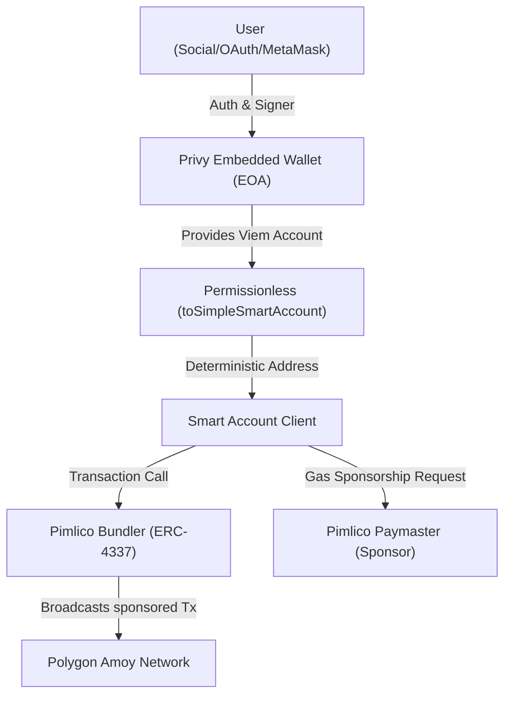

# ERC-4337 Account Abstraction Integration Playbook
### A Developer's Guide to Privy, Pimlico, & Permissionless on Polygon Amoy

This playbook outlines the reference architecture, ideal setups, critical development pitfalls, and lessons learned from building **ChainNotesV2** (a gasless, smart contract note-taking DApp). Use this guide as a template for future high-performance Web3 applications.

---

## 1. Reference Architecture

An ideal ERC-4337 application divides responsibilities into distinct logical layers:



1. **The Signer (EOA)**: Provided by **Privy** (social login, embedded wallets, or fallback external signers like MetaMask).
2. **The Smart Account (ERC-4337)**: Instantiated deterministically using `permissionless/accounts` (`toSimpleSmartAccount`), which maps the EOA signer to a smart contract wallet.
3. **The Bundler**: Relays UserOperations to the network (`bundlerTransport` via Pimlico).
4. **The Paymaster**: Estimates, validates, and sponsors transaction fees gaslessly (`paymaster` via Pimlico).

---

## 2. The Ideal Code Pattern (Refactored & Lean)

Below is the clean, industry-standard pattern for initializing and interacting with a sponsored smart account without unnecessary boilerplate.

### A. Initialization (`src/utils/web3.js`)
```javascript
import { createPublicClient, http } from 'viem';
import { polygonAmoy } from 'viem/chains';
import { toSimpleSmartAccount } from 'permissionless/accounts';
import { createSmartAccountClient } from 'permissionless';
import { createPimlicoClient } from 'permissionless/clients/pimlico';

const ENTRY_POINT_ADDRESS = "0x5FF137D4b0FDCD49DcA30c7CF57E578a026d2789";

// Initialize the Smart Account Client
export const initSmartAccount = async (viemAccount, userAddress) => {
  const publicClient = createPublicClient({
    chain: polygonAmoy,
    transport: http("https://rpc-amoy.polygon.technology") // Public client for state reads
  });

  // 1. Resolve EOA Signer into simple smart account
  const simpleAccount = await toSimpleSmartAccount({
    client: publicClient,
    owner: viemAccount,
    entryPoint: { address: ENTRY_POINT_ADDRESS, version: "0.6" }
  });

  // 2. Initialize Pimlico client for paymaster operations
  const pimlicoUrl = `https://api.pimlico.io/v2/80002/rpc?apikey=${import.meta.env.VITE_PIMLICO_API_KEY}`;
  const pimlicoClient = createPimlicoClient({
    transport: http(pimlicoUrl),
    entryPoint: { address: ENTRY_POINT_ADDRESS, version: "0.6" }
  });

  // 3. Create the Smart Account Client with native paymaster integration
  const smartAccountClient = createSmartAccountClient({
    account: simpleAccount,
    chain: polygonAmoy,
    bundlerTransport: http(pimlicoUrl),
    paymaster: pimlicoClient, // Pass client directly!
    userOperation: {
      estimateFeesPerGas: async () => {
        // Fetch optimized fees directly from Pimlico
        return (await pimlicoClient.getUserOperationGasPrice()).fast;
      }
    }
  });

  return {
    ...smartAccountClient,
    address: simpleAccount.address,
    ownerAddress: userAddress,
  };
};
```

---

## 3. Standard Interactions (Reads & Writes)

### A. Gasless Writing (`writeContract`)
When writing to a smart contract through a Smart Account client, **never use `sendTransaction`**. Standard `sendTransaction` only accepts raw `to`/`value`/`data` parameters. Instead, use `writeContract` which correctly serializes function selectors and ABI arguments.

```javascript
// ✅ CORRECT WAY
const hash = await smartAccountClient.writeContract({
  address: contractAddresses.Notes,
  abi: NotesABI.abi,
  functionName: 'createNote',
  args: [cid],
});
```

### B. Clean Reading with Caller Overrides (`readContract`)
If your smart contract uses `msg.sender` inside view functions (e.g. `returns (string[] memory) { return userNotes[msg.sender]; }`), you **do not need** to scan historical event logs or deal with block limits.

By passing `account: simpleAccount.address` to a public client's `readContract` query, the underlying JSON-RPC node executes `eth_call` with the `from` parameter set as the Smart Account address. This evaluates `msg.sender` inside the contract correctly.

```javascript
// ✅ CORRECT WAY (100% RPC-compliant, zero block range limitations)
const notes = await publicClient.readContract({
  address: contractAddresses.Notes,
  abi: NotesABI.abi,
  functionName: 'getNotes',
  account: simpleAccount.address // ← Overrides msg.sender inside Solidity view call
});
```

---

## 4. Key Lessons & Common Pitfalls

### Pitfall 1: Custom Paymaster Helpers vs Native SDK Clients
*   **The Error**: Passing a custom `paymaster: { getPaymasterStubData, getPaymasterData }` block to `createSmartAccountClient`.
*   **Why it Fails**: Manually constructing stubs (like standard 20-byte dummy address with standard signature length) often leads to malformed hex formatting or validation errors depending on the SDK version. Pimlico's simulation engine rejects invalid stub payloads with `UserOperation reverted during simulation`.
*   **The Resolution**: Pass `paymaster: pimlicoClient` directly. The `permissionless.js` SDK handles all stub creation, fee estimation, gas limit adjustments, and paymaster signatures natively and dynamically.

### Pitfall 2: sendTransaction Calldata Erasure
*   **The Error**: Calling `sendTransaction` with contract `abi`/`functionName`/`args` fields.
*   **Why it Fails**: Under the hood, `sendTransaction` silently ignores ABI-related fields. It broadcasts a transaction with empty calldata (`0x`), which either reverts immediately or calls the fallback function of the target contract.
*   **The Resolution**: Always use `writeContract` for contract interaction.

### Pitfall 3: Event Log Retrieval & RPC Block Range Constraints
*   **The Error**: Querying historical events (`getLogs` or `getContractEvents`) using `fromBlock: "earliest"` to fetch user data.
*   **Why it Fails**: 
    1. **Public RPC Nodes**: Set highly restrictive block range query limits (typically ~10,000 blocks or less). Scanning from `"earliest"` throws `block range exceeds configured limit`.
    2. **Alchemy Free Tier Node**: Limits `eth_getLogs` ranges to exactly **10 blocks** on Polygon Amoy, making history scanning completely unusable.
*   **The Resolution**: Never rely on event scans for primary state checks in the frontend. Use state variables and view functions combined with the `account` caller-override parameter to query current data instantly in a single, limit-free RPC round-trip.

---

## 5. Summary Cheat Sheet

| Operation | Method to Use | Common Mistake | Key Config Parameter |
| :--- | :--- | :--- | :--- |
| **Sponsorship** | `paymaster: pimlicoClient` | Custom stub/data methods | Native SDK client injection |
| **Write Tx** | `smartAccountClient.writeContract` | `sendTransaction` | `abi`, `functionName`, `args` |
| **Read State** | `publicClient.readContract` | `getLogs` / `getContractEvents` | `account: smartAccountAddress` |
| **Node Selection** | Bounded endpoints (`.env`) | Unrestricted public endpoints | Public RPC for reads, private for writes |
